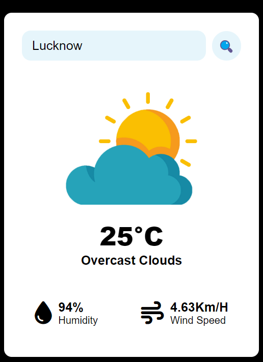
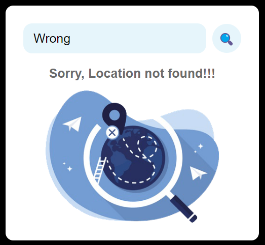

# Weather App

## Description

The Weather App is a simple web application that allows users to check the weather conditions for a specific location. Users can enter their location in the provided input box and click the search button to get the weather information.

- Landing

- Correct Data

- Wrong Data

## Features

- User-friendly interface with a search box to enter the location.
- Displays weather information, including temperature, description, humidity, and wind speed.
- Provides feedback when the location is not found.
- Uses weather icons to represent different weather conditions.

## Usage

1. Open the Weather App in a web browser.
2. In the "Enter your location" input box, type the name of the city or location for which you want to check the weather.
3. Click the search button (🔍) to retrieve the weather information.
4. The app will display the current temperature, weather description, humidity percentage, and wind speed for the specified location.
5. If the location is not found, a "Location not found" message and a 404 error image will be displayed.

